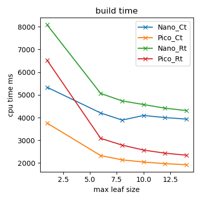
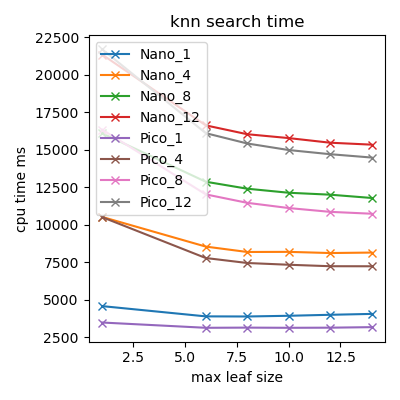
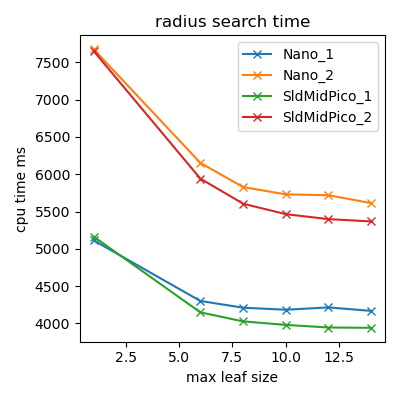
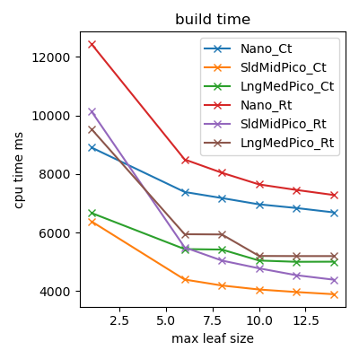
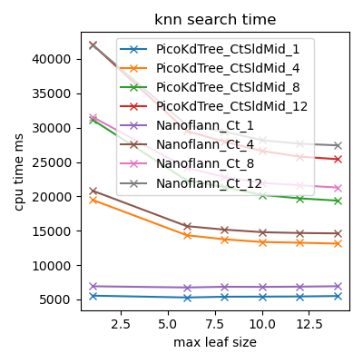
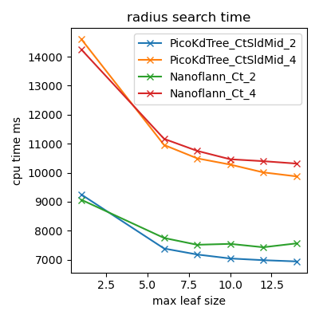

# Benchmark

One of the PicoTree examples is a small [benchmark](./examples/benchmark/) that compares the KdTree of this library with that of [nanoflann](https://github.com/jlblancoc/nanoflann). This page describes several results output by the benchmark and how to reproduce the exact same input that was used to generate the results.

# Data sets

The [Robotic 3D Scan Repository](http://kos.informatik.uni-osnabrueck.de/3Dscans/) provides several 3D point clouds. The following two have been used for the comparison benchmark:

* #25 - Würzburg marketplace. Authors: Johannes Schauer, Andreas Nüchter from the University of Würzburg, Germany.
* #26 - Maria-Schmerz-Kapelle Randersacker. Authors: Andreas Nüchter, Helge Andreas Lauterbach from the University of Würzburg, Germany.

Both have been generated using a LiDAR scanner and represent different types of environments. The running time of the benchmark was kept reasonable by using a subset of points and storing those in a simple binary format. The final point cloud sizes were as follows:

* #25 - Würzburg marketplace: 13729039 points.
* #26 - Maria-Schmerz-Kapelle Randersacker: 20793160 points.

# Results

The KdTree implementations are compared against build time, knn search time and radius search time. All with respect to the tree leaf size. Each algorithm sets the following parameters:

* Build time: Dimensions known at compile time or run time.
* Knn Search: The mount of neighbors searched.
* Radius Search: The radius in meters divided by 4 (0.25m and 0.5m).

Results were generated on: 20-09-2020

## #25 - Würzburg marketplace.

## #26 - Maria-Schmerz-Kapelle Randersacker.

# Running a new benchmark

The following steps can be taken to reproduce the data sets:

1. Download and unpack a data set. This results in a directory containing several pairs of `.3d` and `.pose` files, each representing a LiDAR scan.
2. Delete all scans but the first one (only keeping `scan000.3d` and `scan000.pose`).
3. Run the `uosr_to_bin` executable as a sibling to the scan to generate a `scans.bin` file.

To get performance statistics:

4. Run the `benchmark` executable as a sibling to the `scans.bin` file and set the output format to `json`.
5. Run `plot_benchmarks.py` to show and store the statistics plots.

Note the following:

* The `uosr_to_bin` tool simply combines all pairs of `.3d` and `.pose` into a single `.bin` file. This means a bigger point cloud can be used benchmarking.
* A `.txt` file can be generated from the `.bin` file by running the `bin_to_ascii` executable (as a sibling to the binary file). Each line in the output file is a 3D point.
