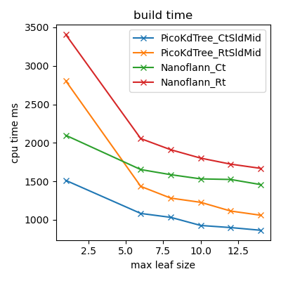
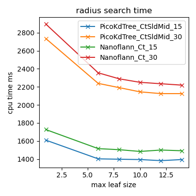
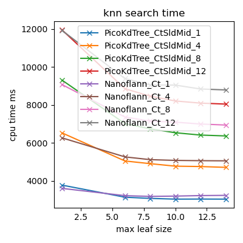

# Benchmark

One of the PicoTree examples contains [benchmarks](../examples/benchmark/) of different KdTree implementations. This page compares the one of PicoTree with respect to [nanoflann](https://github.com/jlblancoc/nanoflann) and describes how to reproduce the input that was used for benchmarking.

Results were generated on: 29-08-2021 using MinGW GCC 10.3 using PicoTree 0.7.4.

# Data sets

The [Robotic 3D Scan Repository](http://kos.informatik.uni-osnabrueck.de/3Dscans/) provides several 3D point clouds that have been generated using a LiDAR scanner. The following has been used for the comparison benchmark:

* #21 - Bremen Gaussian Point. Authors: Dorit Borrmann and Andreas Nüchter from Jacobs University Bremen gGmbH, Germany.

# Results

The different KdTree implementations are compared to each other with respect to the running times of the build, radius search and knn search algorithms, while fixing certain parameters. The speed of each algorithm is plotted against the leaf size of the tree. Each algorithm sets the following parameters:

* Build algorithm: Compile-time vs. run-time tree dimension for the following building techniques:
  * Nanoflann Midpoint variation.
  * PicoTree Sliding Midpoint (along the longest axis).
* Radius search algorithm: The radius in meters divided by 10 (i.e. 1.5m and 3.0m).
* Knn algorithm: The number of neighbors searched.

The running time of the benchmark was kept reasonable by using two subsets of points and storing those in a simple binary format. The final point cloud sizes were as follows:

* Part 1: 7733372 points.
* Part 2: 7200863 points.

Both parts are 360 degree scans taken from different positions. The first is used to build a tree and the second for querying that tree. Note that each run time describes a single invocation of a build algorithm and n invocations of the others.

# Running a new benchmark

The following steps can be taken to generate data sets:

1. Download and unpack a data set. This results in a directory containing pairs of `.3d` and `.pose` files, each representing a LiDAR scan.
2. Select any of the scans (corresponding pairs of `.3d` and `.pose` files) to compile into a binary.
3. Run the `uosr_to_bin` executable as a sibling to the selected scans to generate a `scans.bin` file.
4. Two point clouds are required for a benchmark. The first should be named `scans0.bin` and the second `scans1.bin`.

To reproduce the exact point clouds used by the benchmark on the Bremen Gaussian Point dataset, use scans 0-8 for the first cloud and scans 9-17 for the second.

To get performance statistics:

5. Run the `bm_pico_kd_tree` or `bm_nanoflann` executables as a sibling to the `scans.bin` file and set the output format to `json`.
6. Run `plot_benchmarks.py` to show and store the performance plots (requires Python with [Matplotlib](https://matplotlib.org/)).

Note the following:

* A `scans.txt` file can be generated from the `scans.bin` file by running the `bin_to_ascii` executable (as a sibling to the binary file). Each line in the output file is a 3D point.
